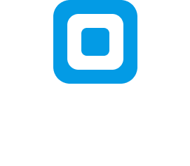

# Square | Brand

This repository contains resources for the Square brand such as logos, banners, icons, color palettes and other design files.
We use [Figma](https://www.figma.com/) to create, mantain and update the design files of Square (Figma is fantastic!).

## Logos

**Logo without text**

**Alternative logo without text**

**Horizontal logo**

**Horizontal logo with black text**

**Vertical logo**

**Vertical logo with black text**

## Icons

The icons used in Square were created specifically for the platform using **Figma**. You can see them [here](./icons/).

## Brand colors

We chose a few colors for the overall design of Square, because what we have in mind is to build a serious and minimal ecosystem.

Dark grey `#151414`

Grey `#383535`

Azure `#039BE5`

Light grey `#B5ADAD`

## Font used

Square uses [Inter](https://rsms.me/inter) as font. This font presents a coexistence of curved and broken lines and the [icons](./icons/) follow this style.

## Trademark and other things to know

As you can see in the [license](./LICENSE), "Square Network" is a trademark of Vincenzo Ingrao Jr.

To quote Square's name, capitalize the "S" in Square in all copy text. Square shouldn't be presented in all lowercase.